.. _cg.lino.site:

====================
What is a Lino site?
====================

A :term:`Lino site` is a website that looks much like a desktop application and
has been developed according to your specific needs using the :term:`Lino
framework`. You defined the **database structure** (how your data is stored),
the **view layouts** (how end users see your data) and the **actions** (what
users can do with your data). You also manage user accounts of your site and
assign permissions according to your rules.

Most :term:`Lino sites <Lino site>` are meant for internal use by your employees
or business partners, not as a public website. All Lino sites have the same look
and feel, which is optimized for intensive daily usage. With Lino you don't want
to care (and to pay) for a customized look and feel of your site. To be exact,
there are currently two choices regarding the look and feel of your site. You
can choose (and easily switch) between two web front ends: the classic one based
on **ExtJS** and the younger on based on **ReactJS**.

The luxury of developing and maintaining your own application is usually very
expensive and makes sense only for bigger companies.  Lino makes it possible
also for small and medium-sized organizations.

Some screenshots:

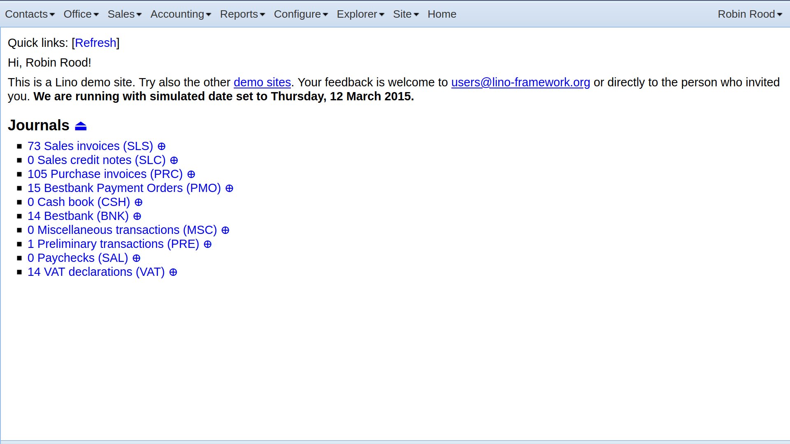

  Main screen after signing in as user Robin in Lino Così using the ExtJS front
  end.  The only dashboard item is an overview of your ledger journals.

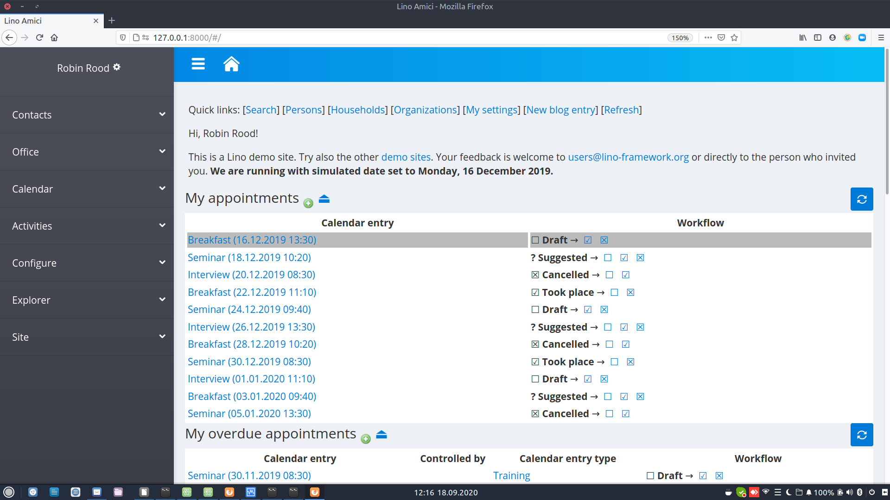

  Main screen after signing in as user Robin in Lino Amici using the ReactJS
  front end. The dashboard contains a series of items, the first being the "My
  appointments" table.

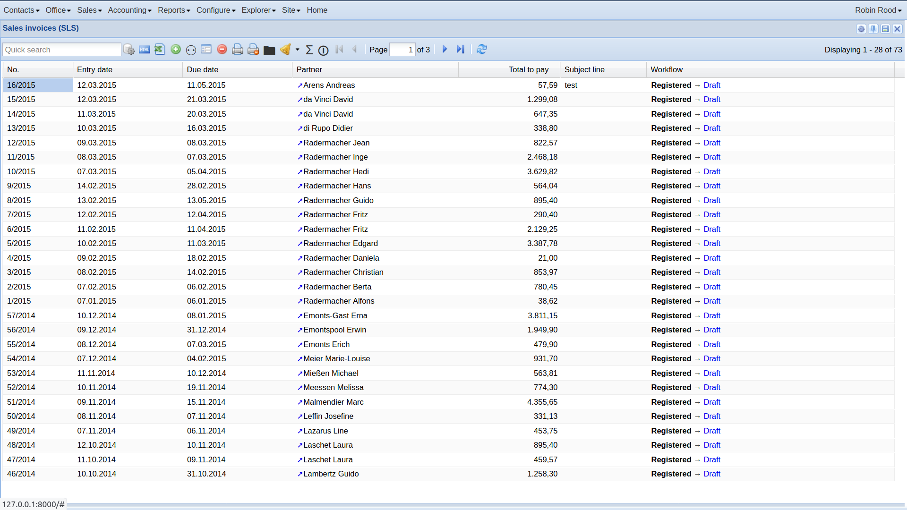

  A list of your sales invoices.

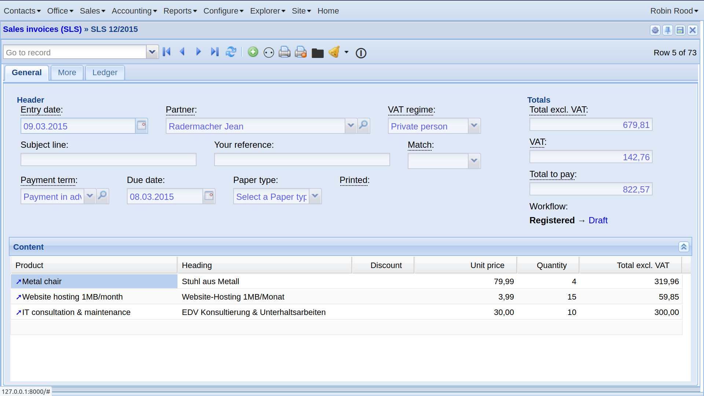

  Detail view of a sales invoice.

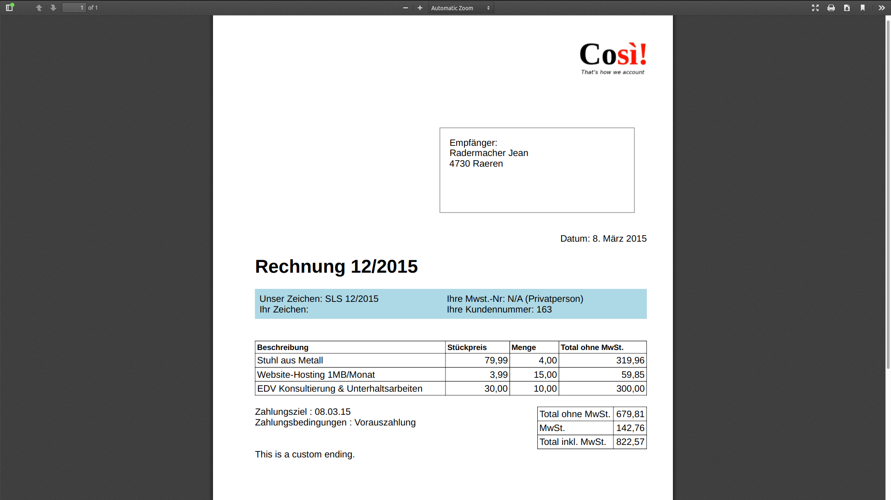

  A sales invoice as a printable pdf document.

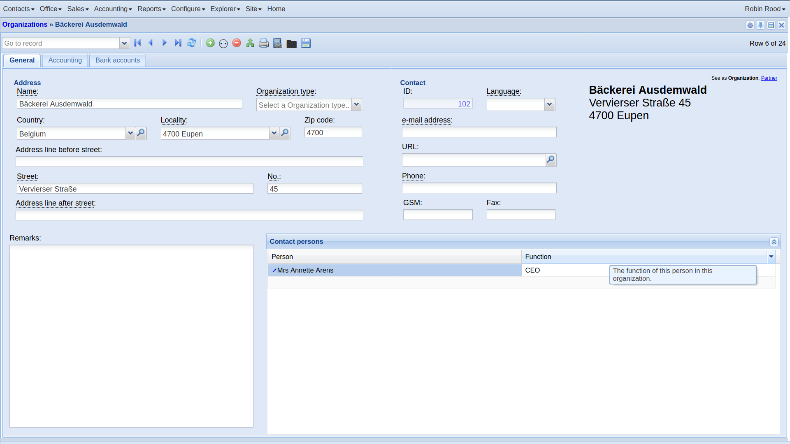

  Detail view of an organization in Lino Così.

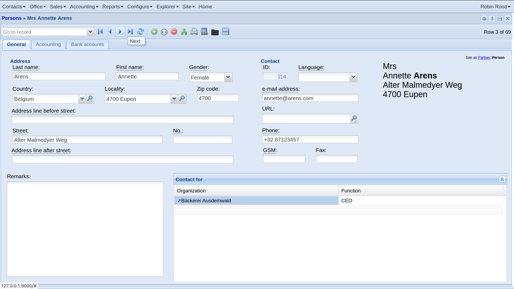

  Detail view of a person in Lino Così.

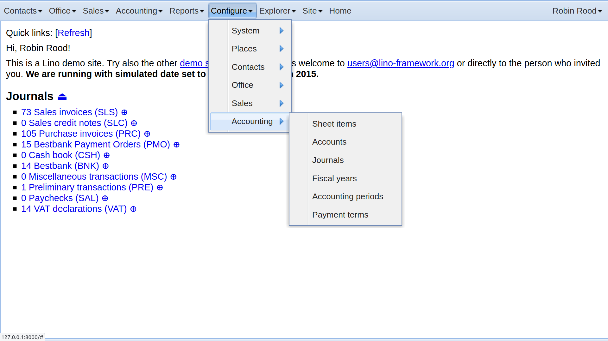

  The :menuselection:`Configure` menu in Lino Così.

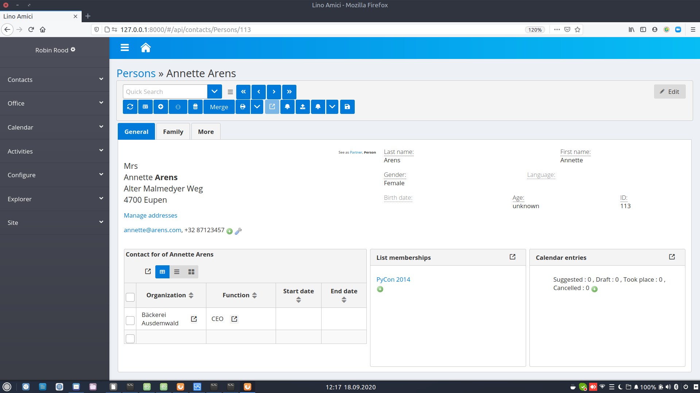

  Detail view of a person in Lino Amici.

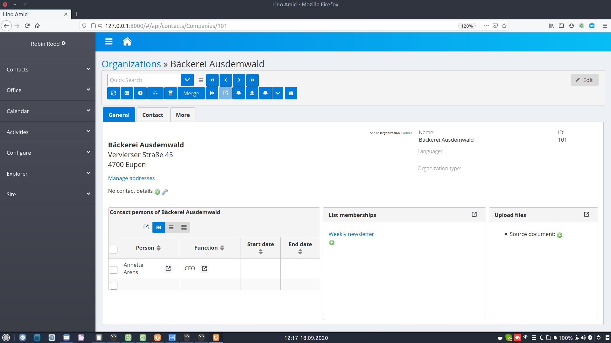

  Detail view of an organization in Lino Amici.

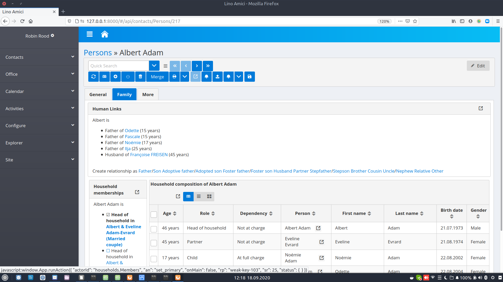

  The Family tab in the detail view of a person in Lino Amici.

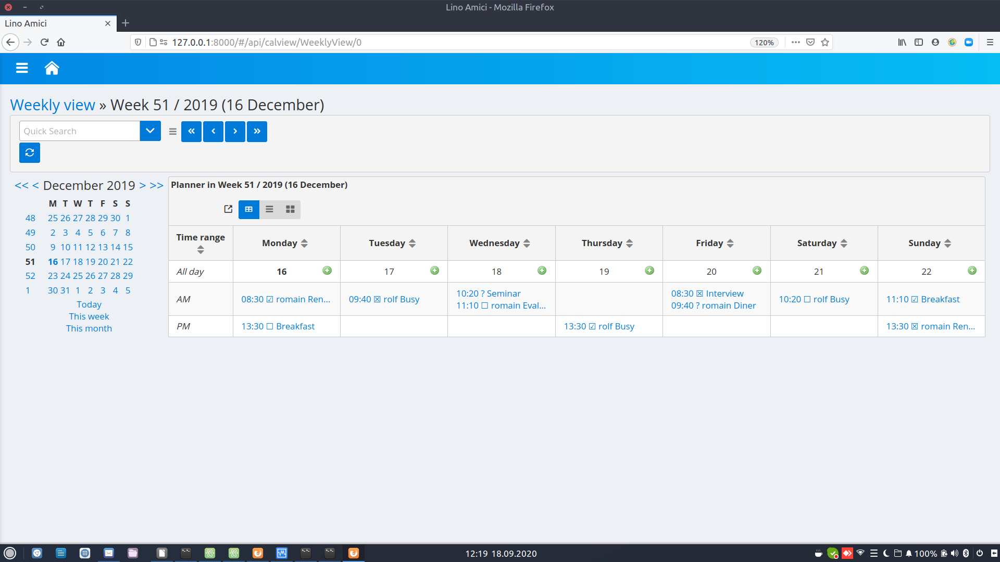

  Weekly calendar view in Lino Amici.

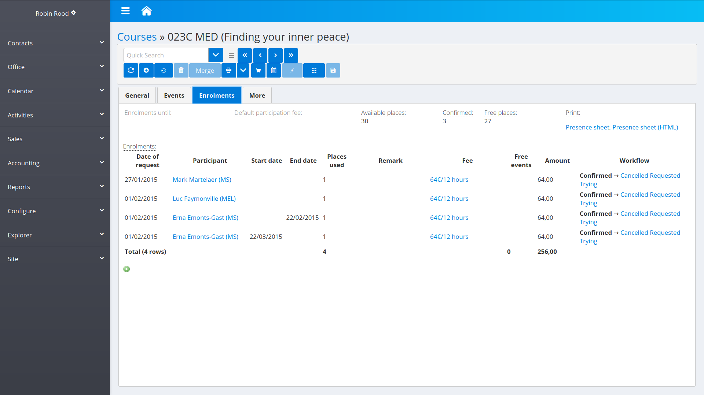

  Enrolments tab in the detail view of an activity in Lino Voga.
